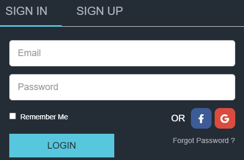

# Histórias de Usuário e Critérios de Aceite – SIEIRNEWS

## Usuário 1: Login e Acesso ao Dashboard

**Como** um usuário,
**Quero** fazer login no sistema com meu e-mail e senha,
**Para** acessar os dashboards e visualizar informações financeiras e notícias.

### Critérios de Aceite
- O usuário deve conseguir acessar a tela de login.
- O sistema deve validar e autenticar o e-mail e senha.
- Se as credenciais estiverem corretas, o usuário é redirecionado ao dashboard.
- Se as credenciais estiverem incorretas, uma mensagem de erro clara deve ser exibida.
- O usuário autenticado deve permanecer logado até sair manualmente.

---

## Usuário 2: Visualização de Dados em Tempo Real

**Como** um usuário autenticado,
**Quero** visualizar dados financeiros e notícias atualizados automaticamente,
**Para** tomar decisões rápidas e informadas.

### Critérios de Aceite
- Os dados de ativos e notícias devem ser atualizados automaticamente sem recarregar a página, acada 5 segundos esses dados são extraido das URLs (https://finance.yahoo.com/news/, https://www.financialjuice.com/home), porem para a url https://www.financialjuice.com/home tem uma necessidade de logar no sistema por meio da imagem abaixo:

- O usuário deve ver um indicador de atualização/"ao vivo".
- O usuário pode congelar/descongelar a atualização automática.
- O horário da última atualização deve ser exibido.

---

## Usuário 3: Personalização do Dashboard

**Como** um usuário,
**Quero** personalizar a disposição dos painéis no dashboard,
**Para** adaptar a visualização às minhas necessidades.

### Critérios de Aceite
- O usuário pode arrastar e soltar painéis para reorganizar.
- O usuário pode redimensionar painéis.
- O usuário pode adicionar ou remover painéis.
- O layout personalizado deve ser salvo e restaurado ao recarregar.

---

## Usuário 4: Visualização, Filtros e Busca de Notícias

**Como** um usuário,
**Quero** visualizar as notícias extraídas das fontes externas de forma clara, com possibilidade de filtrar e buscar por palavra-chave,
**Para** encontrar rapidamente informações relevantes e acompanhar o fluxo de notícias em tempo real.

- As notícias devem ser exibidas em ordem cronológica, da mais recente para a mais antiga.
- Cada notícia deve apresentar título, resumo, data/hora, fonte e, se disponível, o ticker relacionado.
- Se a notícia contiver recomendação de compra ou venda, a mensagem deve ser exibida de forma destacada (ex: cor, badge ou ícone).
- Notícias novas devem aparecer automaticamente sem recarregar a página.
- O usuário pode digitar palavras-chave para filtrar as notícias exibidas.
- O sistema destaca visualmente as palavras-chave encontradas nas notícias (ex: marca-texto).
- O filtro pode ser limpo facilmente, retornando à visualização completa.
- O usuário deve conseguir identificar a fonte de cada notícia (ex: Yahoo Finance, FinancialJuice).
- O horário da última atualização do feed de notícias deve ser exibido.

---

## Usuário 5: Segurança e Privacidade

**Como** um usuário,
**Quero** que meus dados estejam protegidos e acessíveis apenas por mim,
**Para** garantir minha privacidade e segurança.

### Critérios de Aceite
- O sistema utiliza autenticação JWT para proteger rotas e dados.
- Dados sensíveis não são expostos no frontend.
- O usuário só acessa dados após autenticação válida.

---

## Usuário 6: Atualização Automática de Dados Externos

**Como** um administrador,
**Quero** que o sistema extraia e atualize automaticamente dados do Yahoo Finance e FinancialJuice,
**Para** garantir que os usuários tenham sempre informações recentes.

### Critérios de Aceite
- O sistema executa scrapers periodicamente para buscar dados externos.
- Os dados extraídos são processados e armazenados corretamente.
- O frontend consome sempre os dados mais recentes via API.
- Logs de execução dos scrapers podem ser monitorados.

---

## Usuário 7: Visualização de Mercado e Pré-Mercado

**Como** um usuário,
**Quero** visualizar separadamente os dados de Mercado (horário regular) e Pré-Mercado (after/pre-market),
**Para** entender o comportamento dos ativos em diferentes períodos de negociação.

### Critérios de Aceite
- O dashboard deve exibir claramente os campos "Mercado" (11:30-18:00) e "Pré-Mercado" (19:20-10:59) para cada ativo.
- Os dados de cada período devem ser atualizados automaticamente conforme o horário vigente.
- O usuário deve conseguir identificar facilmente em qual período está visualizando os dados.
- O sistema deve destacar visualmente a transição entre os períodos (ex: cor, badge ou mensagem).
- O horário de atualização e a fonte dos dados devem ser exibidos para cada campo.

---

## Usuário 8: Congelamento e Descongelamento de Dados

**Como** um usuário,
**Quero** poder congelar e descongelar a atualização automática dos dados exibidos no dashboard,
**Para** analisar informações em um determinado momento sem que elas mudem automaticamente.

### Critérios de Aceite
- O usuário pode clicar em um botão para congelar a atualização dos dados exibidos.
- Ao congelar, os dados param de ser atualizados automaticamente e um indicador visual de "congelado" é exibido.
- O usuário pode clicar em "descongelar" para retomar a atualização automática.
- O sistema deve garantir que, ao descongelar, os dados sejam imediatamente atualizados para o estado mais recente.
- O status de congelamento deve ser claro e visível para o usuário.
